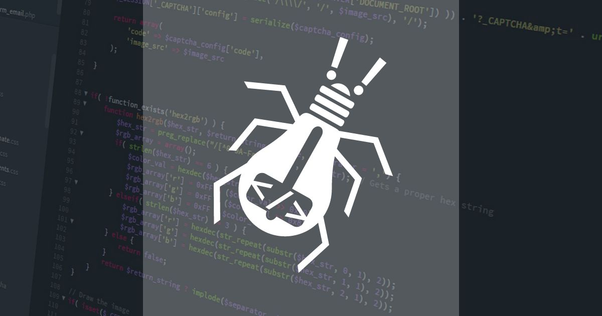

<!-- markdownlint-disable-file MD033 -->
# Programação Orientada a Gambiarra - O Livro



Como garantir que o inferno seja uma amostra grátis do seu trabalho!

[](https://discord.gg/DeUKq9xw88) [](https://github.com/josenaldo/livro-pog) [](https://twitter.com/josenaldomatos) [](https://livropog.com.br/capitulos)

## :scroll: Índice

- [Programação Orientada a Gambiarra - O Livro](#programação-orientada-a-gambiarra---o-livro)
  - [:scroll: Índice](#scroll-índice)
  - [:bookmark: Descrição do Livro](#bookmark-descrição-do-livro)
  - [:link: Acesso ao Livro](#link-acesso-ao-livro)
  - [:construction: Status do Livro](#construction-status-do-livro)
  - [:gear: Como o Projeto Foi Feito](#gear-como-o-projeto-foi-feito)
    - [Arquitetura Geral](#arquitetura-geral)
    - [Pipeline de Publicação](#pipeline-de-publicação)
  - [:wrench: Tecnologias Utilizadas](#wrench-tecnologias-utilizadas)
  - [:file\_folder: Estrutura do Projeto](#file_folder-estrutura-do-projeto)
  - [:computer: Pré-requisitos](#computer-pré-requisitos)
  - [:rocket: Como Rodar o Projeto](#rocket-como-rodar-o-projeto)
    - [1. Clonar o Repositório](#1-clonar-o-repositório)
    - [2. Instalar as Dependências](#2-instalar-as-dependências)
    - [3. Configurar as Variáveis de Ambiente](#3-configurar-as-variáveis-de-ambiente)
    - [4. Iniciar o Servidor de Desenvolvimento](#4-iniciar-o-servidor-de-desenvolvimento)
    - [5. Gerar o Build de Produção](#5-gerar-o-build-de-produção)
  - [:pencil: Como Funciona o Conteúdo](#pencil-como-funciona-o-conteúdo)
    - [Estrutura dos Capítulos](#estrutura-dos-capítulos)
    - [Estrutura dos Posts do Blog](#estrutura-dos-posts-do-blog)
    - [Status dos Capítulos](#status-dos-capítulos)
    - [Ícones](#ícones)
  - [:book: Geração de eBooks](#book-geração-de-ebooks)
    - [Com Pandoc Instalado Localmente](#com-pandoc-instalado-localmente)
    - [Com Docker (Recomendado)](#com-docker-recomendado)
  - [:robot: CI/CD e Automação](#robot-cicd-e-automação)
  - [:mag: Busca](#mag-busca)
  - [:iphone: PWA e Suporte Offline](#iphone-pwa-e-suporte-offline)
  - [:boy: Autor](#boy-autor)
  - [:money\_with\_wings: Colabore](#money_with_wings-colabore)
  - [:page\_facing\_up: Licença](#page_facing_up-licença)

## :bookmark: Descrição do Livro

O Livro POG é um projeto de documentação da técnica de desenvolvimento de software mais utilizada do mercado, a **Programação Orientada a Gambiarra (POG)**.

O intuito desse livro é documentar a história da POG, fazer uma breve introdução ao assunto, demonstrar quais são os requisitos necessários para o nascimento da POG, explicar as técnicas utilizadas no sumonamento da POG e os principais padrões de projeto de gambiarra: os **Gambi Design Patterns (GDPs)**.

<p align='right'><a href='#programação-orientada-a-gambiarra---o-livro'>Topo</a></p>

## :link: Acesso ao Livro

O livro pode ser acessado gratuitamente em <https://livropog.com.br>. Versões do livro em EPUB e PDF são geradas automaticamente e podem ser baixadas na página do livro.

<p align='right'><a href='#programação-orientada-a-gambiarra---o-livro'>Topo</a></p>

## :construction: Status do Livro

O livro está em desenvolvimento e o status de cada capítulo pode ser verificado em <https://livropog.com.br/capitulos>. Cada capítulo pode ter um dos seguintes status:

| Status     | Descrição                               |
| ---------- | --------------------------------------- |
| `backlog`  | Planejado, mas ainda não iniciado       |
| `progress` | Em escrita ativa                        |
| `review`   | Escrito, passando por revisão e ajustes |
| `done`     | Revisado e publicado                    |

<p align='right'><a href='#programação-orientada-a-gambiarra---o-livro'>Topo</a></p>

## :gear: Como o Projeto Foi Feito

Este projeto não é apenas um livro — é uma **plataforma editorial completa** para um livro vivo. A ideia central é ter um ciclo simples e confiável: **escrever → versionar → publicar → evoluir**.

### Arquitetura Geral

O conteúdo do livro é escrito em **Markdown**, versionado no Git e processado pelo **Contentlayer**, que transforma os arquivos `.md` em JSON tipado, consumido pela aplicação Next.js.

```
content/ (Markdown)
    └─► Contentlayer (compila e tipifica)
            └─► Next.js (rotas, componentes, API)
                    └─► Vercel (deploy automático)
```

Isso mantém uma separação clara entre **conteúdo** e **aplicação**: o autor pode focar em escrever sem precisar mexer em código, e o desenvolvedor pode evoluir a plataforma sem quebrar o conteúdo.

### Pipeline de Publicação

Quando um capítulo com `status: done` é commitado na branch `main`:

1. O GitHub Actions detecta a mudança nos arquivos de `content/capitulos/`.
2. O script `generate-ebook.js` combina os capítulos em um único Markdown.
3. O Pandoc converte esse Markdown para **PDF** (via XeLaTeX) e **EPUB**.
4. Os arquivos gerados são commitados de volta no repositório em `public/downloads/`.
5. A Vercel detecta o novo commit e faz o deploy do site atualizado automaticamente.

<p align='right'><a href='#programação-orientada-a-gambiarra---o-livro'>Topo</a></p>

## :wrench: Tecnologias Utilizadas

| Categoria            | Tecnologia                                                                                  | Uso                                                         |
| -------------------- | ------------------------------------------------------------------------------------------- | ----------------------------------------------------------- |
| **Framework**        | [Next.js 16](https://nextjs.org/) + [React 19](https://reactjs.org/)                        | Base da aplicação web com App Router                        |
| **UI**               | [MUI v7](https://mui.com/)                                                                  | Componentes de interface e sistema de temas                 |
| **Conteúdo**         | [Contentlayer2](https://www.contentlayer.dev/)                                              | Transforma Markdown em JSON tipado (fonte única de verdade) |
| **Markdown**         | [Remark](https://github.com/remarkjs/remark) + [Rehype](https://github.com/rehypejs/rehype) | Pipeline de processamento do Markdown para HTML             |
| **Syntax Highlight** | [rehype-prism-plus](https://github.com/timlrx/rehype-prism-plus)                            | Realce de sintaxe nos blocos de código                      |
| **Citações**         | [rehype-citation](https://github.com/timlrx/rehype-citation)                                | Suporte a referências bibliográficas (BibTeX)               |
| **Busca**            | [Lunr.js](https://lunrjs.com/)                                                              | Busca full-text local, sem dependência de serviço externo   |
| **HTTP Client**      | [Axios](https://axios-http.com/)                                                            | Chamadas à API de busca                                     |
| **SEO**              | [Next SEO](https://github.com/garmeeh/next-seo)                                             | Configuração de meta tags e OpenGraph                       |
| **Sitemap**          | [next-sitemap](https://github.com/iamvishnusankar/next-sitemap)                             | Geração automática de `sitemap.xml` e `robots.txt`          |
| **PWA**              | [@ducanh2912/next-pwa](https://github.com/DuCanhGH/next-pwa)                                | Suporte offline com Workbox e service worker                |
| **Ícones**           | [Tabler Icons](https://tabler.io/icons)                                                     | Biblioteca de ícones para capítulos e interface             |
| **Datas**            | [date-fns](https://date-fns.org/)                                                           | Formatação de datas                                         |
| **eBooks**           | [Pandoc](https://pandoc.org/)                                                               | Conversão do Markdown para PDF e EPUB                       |
| **eBooks (CI)**      | Docker + XeLaTeX                                                                            | Geração reproduzível dos eBooks no CI/CD                    |
| **Hospedagem**       | [Vercel](https://vercel.com/)                                                               | Deploy automático a partir da branch `main`                 |

<p align='right'><a href='#programação-orientada-a-gambiarra---o-livro'>Topo</a></p>

## :file_folder: Estrutura do Projeto

```
livro-pog/
├── content/                    # Conteúdo do livro e do blog (Markdown)
│   ├── blog/                   # Posts do blog
│   └── capitulos/              # Capítulos do livro
│       ├── historia.md
│       ├── requisitos/         # Capítulo pai: Requisitos da POG
│       ├── tecnicas/           # Capítulo pai: Técnicas
│       └── gambi-design-patterns/ # Capítulo pai: Gambi Design Patterns
│
├── src/
│   ├── app/                    # Rotas (Next.js App Router)
│   │   ├── (site)/             # Páginas públicas (home, blog, capítulos, busca)
│   │   ├── api/                # API Routes (busca, OG images)
│   │   └── offline/            # Página de fallback offline
│   ├── components/             # Componentes React reutilizáveis
│   ├── config/                 # Configuração de SEO
│   ├── contexts/               # Contextos React (ConfigContext)
│   ├── data/                   # Camada de acesso a dados (Chapters, Posts)
│   ├── lib/                    # Utilitários (OG image, ícones, analytics)
│   ├── styles/                 # Tema MUI, paletas, CSS global
│   └── utils/                  # Funções utilitárias (data, arquivos)
│
├── public/
│   ├── downloads/              # eBooks gerados (PDF, EPUB)
│   ├── images/                 # Imagens estáticas e OG images geradas
│   ├── icons/                  # Ícones do PWA
│   └── manifest.json           # Manifesto do PWA
│
├── scripts/                    # Scripts de build e geração
│   ├── generate-ebook.js       # Combina capítulos em um único Markdown
│   ├── generate-og-images.js   # Pré-gera imagens OpenGraph
│   ├── docker-build.sh         # Constrói imagem Docker para os eBooks
│   ├── docker-generate.sh      # Gera eBooks via Docker
│   └── pandoc/                 # Configurações do Pandoc (PDF e EPUB)
│
├── _bibliography/
│   └── library.bib             # Referências bibliográficas (BibTeX)
│
├── .github/
│   └── workflows/
│       └── generate-ebook.yml  # Pipeline de geração automática dos eBooks
│
├── contentlayer.config.js      # Schema e configuração do Contentlayer
├── next.config.js              # Configuração do Next.js (PWA, aliases, imagens)
├── next-sitemap.config.js      # Configuração do sitemap
├── estrutura-livro.txt         # Ordem de compilação dos capítulos para o eBook
└── EBOOK-DEV.md                # Guia de desenvolvimento dos eBooks
```

<p align='right'><a href='#programação-orientada-a-gambiarra---o-livro'>Topo</a></p>

## :computer: Pré-requisitos

Antes de começar, você vai precisar de:

- **Node.js** >= 18 — [nodejs.org](https://nodejs.org)
- **Yarn** >= 1.22 — instalável com `npm install -g yarn`
- **Git**

Para gerar os eBooks **localmente** (opcional), você também precisará de:

- **Pandoc** >= 3.x — [pandoc.org](https://pandoc.org/installing.html)
- **XeLaTeX** (para PDF) — incluso no `texlive-full` ou `MacTeX`

Ou simplesmente use o **Docker**, que já inclui tudo (ver seção [Geração de eBooks](#book-geração-de-ebooks)).

<p align='right'><a href='#programação-orientada-a-gambiarra---o-livro'>Topo</a></p>

## :rocket: Como Rodar o Projeto

### 1. Clonar o Repositório

```bash
git clone https://github.com/josenaldo/livro-pog.git
cd livro-pog
```

### 2. Instalar as Dependências

```bash
yarn install
```

### 3. Configurar as Variáveis de Ambiente

O projeto já vem com os arquivos `.env.development` e `.env.production`. Para desenvolvimento local, nenhuma configuração adicional é necessária. As variáveis disponíveis são:

| Variável               | Padrão (dev)            | Descrição                                       |
| ---------------------- | ----------------------- | ----------------------------------------------- |
| `NEXT_PUBLIC_SITE_URL` | `http://localhost:6500` | URL base do site (usado em canonical, OG e PWA) |
| `STATIC_PAGES_TTL`     | `3`                     | TTL em segundos para cache de páginas estáticas |
| `NEXT_PUBLIC_GA_ID`    | _(vazio)_               | ID do Google Analytics (opcional)               |
| `NEXT_PUBLIC_PWA_DEV`  | _(vazio)_               | Defina como `true` para habilitar PWA em dev    |

### 4. Iniciar o Servidor de Desenvolvimento

```bash
yarn dev
```

O site estará disponível em `http://localhost:6500`.

O Contentlayer processa os arquivos Markdown automaticamente — ao editar qualquer arquivo em `content/`, o site é recarregado com o conteúdo atualizado.

### 5. Gerar o Build de Produção

```bash
yarn build
```

Este comando executa três etapas em sequência:

1. **Contentlayer** compila os arquivos Markdown em JSON.
2. **Next.js** gera o build otimizado.
3. **next-sitemap** gera o `sitemap.xml` e o `robots.txt`.

Para rodar o build de produção localmente:

```bash
yarn start
```

<p align='right'><a href='#programação-orientada-a-gambiarra---o-livro'>Topo</a></p>

## :pencil: Como Funciona o Conteúdo

Todo o conteúdo do livro e do blog fica na pasta `content/` como arquivos Markdown com frontmatter YAML. O Contentlayer lê esses arquivos, valida os campos e os disponibiliza como dados tipados para a aplicação.

### Estrutura dos Capítulos

Cada arquivo em `content/capitulos/` é um capítulo. Capítulos podem ser organizados em subpastas para criar uma hierarquia (capítulo pai > capítulos filhos).

**Exemplo de frontmatter de capítulo:**

```yaml
---
title: "História da POG"
description: "A origem e a evolução da Programação Orientada a Gambiarra"
date: "2024-01-15"
sentence: "Toda grande gambiarra começa com um prazo impossível."
sentence_author: "Sábio Anônimo do Stack Overflow"
name: "historia"
order_number: 1
status: "done"
icon: "tabler/IconBooks"
---

Conteúdo do capítulo em Markdown aqui...
```

**Campos obrigatórios:**

| Campo             | Tipo   | Descrição                                                       |
| ----------------- | ------ | --------------------------------------------------------------- |
| `title`           | string | Título do capítulo                                              |
| `description`     | string | Descrição curta (usada em SEO e cards)                          |
| `date`            | date   | Data de criação ou última atualização                           |
| `sentence`        | string | Citação exibida no início do capítulo                           |
| `sentence_author` | string | Autor da citação                                                |
| `name`            | string | Identificador interno único (usado em breadcrumbs e hierarquia) |
| `order_number`    | number | Número de ordem na compilação do eBook                          |
| `status`          | enum   | `backlog`, `progress`, `review` ou `done`                       |
| `icon`            | string | Ícone Tabler no formato `tabler/IconNome`                       |

**Campos opcionais:**

| Campo      | Tipo    | Descrição                                           |
| ---------- | ------- | --------------------------------------------------- |
| `parent`   | string  | `name` do capítulo pai (para criar hierarquia)      |
| `isParent` | boolean | `true` para marcar o capítulo como pai de uma seção |

### Estrutura dos Posts do Blog

Cada arquivo em `content/blog/` é um post.

**Exemplo de frontmatter de post:**

```yaml
---
title: "Por que todo código vira POG"
description: "Uma análise profunda da inevitabilidade da gambiarra"
date: "2024-03-10"
author: "Josenaldo Matos"
icon: "tabler/IconBug"
---

Conteúdo do post em Markdown...
```

### Status dos Capítulos

Apenas capítulos com `status: done` são incluídos na compilação dos eBooks. Os demais aparecem no site com indicadores visuais de progresso.

### Ícones

Os ícones são referenciados no frontmatter no formato `tabler/IconNome`, onde `IconNome` é o nome do componente na biblioteca [Tabler Icons](https://tabler.io/icons). Por exemplo: `tabler/IconBooks`, `tabler/IconBug`, `tabler/IconCode`.

<p align='right'><a href='#programação-orientada-a-gambiarra---o-livro'>Topo</a></p>

## :book: Geração de eBooks

O projeto gera automaticamente versões em PDF e EPUB do livro usando o [Pandoc](https://pandoc.org/). Apenas capítulos com `status: done` são incluídos, e a ordem de compilação é definida pelo arquivo `estrutura-livro.txt`.

### Com Pandoc Instalado Localmente

```bash
# Gerar apenas o Markdown combinado
yarn ebook:markdown

# Gerar o PDF (requer Pandoc + XeLaTeX)
yarn ebook:pdf

# Gerar o EPUB (requer Pandoc)
yarn ebook:epub

# Gerar todos os formatos
yarn ebook:all
```

### Com Docker (Recomendado)

Se você não quiser instalar Pandoc e LaTeX localmente, use o Docker:

```bash
# Construir a imagem Docker (apenas uma vez)
yarn ebook:docker:build

# Gerar o PDF via Docker
yarn ebook:docker:pdf

# Gerar o EPUB via Docker
yarn ebook:docker:epub

# Gerar todos os formatos via Docker
yarn ebook:docker:all
```

Os arquivos gerados ficam em `public/downloads/`:

- `livro-pog.pdf`
- `livro-pog.epub`
- `livro-pog-combined.md` (Markdown combinado intermediário)

Consulte o arquivo `EBOOK-DEV.md` para detalhes sobre a configuração do Pandoc e personalização do layout dos eBooks.

<p align='right'><a href='#programação-orientada-a-gambiarra---o-livro'>Topo</a></p>

## :robot: CI/CD e Automação

O projeto usa **GitHub Actions** para gerar os eBooks automaticamente sempre que há mudanças na pasta `content/capitulos/` na branch `main`.

**O pipeline (`.github/workflows/generate-ebook.yml`):**

1. Instala Node.js, Pandoc e o ambiente LaTeX completo.
2. Executa `generate-ebook.js` para combinar os capítulos.
3. Gera o PDF com XeLaTeX (tipografia em português, fonte DejaVu).
4. Gera o EPUB com capa e CSS customizado.
5. Commita os arquivos gerados de volta no repositório com `[skip ci]`.

O deploy na Vercel é acionado automaticamente pelo commit gerado pelo CI, mantendo os downloads sempre atualizados no site de produção.

<p align='right'><a href='#programação-orientada-a-gambiarra---o-livro'>Topo</a></p>

## :mag: Busca

A busca é implementada com **Lunr.js** — uma biblioteca de busca full-text que roda inteiramente no servidor, sem dependência de serviços externos.

**Como funciona:**

1. A API em `/api/search?q={termo}` recebe a query.
2. O servidor indexa todos os capítulos e posts (título, descrição e conteúdo).
3. O Lunr executa a busca no índice e retorna os resultados ordenados por relevância.
4. O cliente consome essa API via Axios e exibe os resultados na página de busca (`/pesquisa`).

<p align='right'><a href='#programação-orientada-a-gambiarra---o-livro'>Topo</a></p>

## :iphone: PWA e Suporte Offline

O site é uma **Progressive Web App (PWA)**, o que significa que pode ser instalado no celular ou desktop e funciona mesmo sem conexão com a internet.

**Estratégia de cache (Workbox):**

- Capítulos já visitados ficam em cache por **7 dias** (estratégia `NetworkFirst`).
- Se o usuário estiver offline e tentar acessar uma página não cacheada, é exibida a página `/offline`.
- As imagens OpenGraph (`/api/og`) nunca são cacheadas (sempre buscadas da rede).

Para testar o PWA localmente, defina `NEXT_PUBLIC_PWA_DEV=true` no arquivo `.env.development`.

<p align='right'><a href='#programação-orientada-a-gambiarra---o-livro'>Topo</a></p>

## :boy: Autor


Olá. Meu nome é **Josenaldo de Oliveira Matos Filho**. Sou POGramador desde 1999. Durante a maior parte de minha vida profissional (2003-2016), escrevi gambiarras em Java, principalmente Spring e Java EE. Também já me meti a besta com PHP, Ruby, VBA, Flex... E coisas das quais eu me envergonho profundamenrte, como WebSphere e Vignette.

Nasci em Ubatã, uma cidade perdida no interior da Bahia. Moro, desde 2008, em Uberlândia-MG, pra onde fugi depois que abandonei a faculdade pra ganhar dinheiros. Nesse mesmo ano, eu perdi meus dois rins (só não me lembro onde) e passei a fazer hemodiálise.

Hoje, escrevo pogs em Java, Javasrcript, Typescript e Python. Também brinco com Go. mas, no trabalho, o que eu faço é cuidar sozinho de aplicações, entregando de ponta a ponta o seu projeto.

Dentre algumas de minhas mais notáveis realizações fora da TI, estão:

- Criei a [Farofa Lampião e Julieta](https://josenaldo.github.io/farofa-lampiao-e-julieta/), meu grande legado para a humanidade.
- Quebrei as duas pernas, em momentos diferentes (agosto de 2020 e janeiro de 2022), sendo que a última foi uma **FRATURA EXPONTÂNEA**.
- Quebrei as duas pernas **DE NOVO**, em 2025. E dessa vez, fora as duas juntas, numa apoteótica **fratura espontânea bilateral de fêmur**, o que já me rendeu, até o momento dessa última alteração, mais de 8 meses e cama.
- [Perdi o rim da minha sogra](https://g1.globo.com/mg/minas-gerais/bom-dia-minas/video/sogra-doa-rim-ao-genro-em-uberlandia-2741082.ghtml).

Quer me achar?

- Website: <https://josenaldo.com.br>
- Github: [@josenaldo](https://github.com/josenaldo)
- LinkedIn: [@josenaldo](https://linkedin.com/in/josenaldo)
- Bluesky: [@josenaldomatos](https://bsky.app/profile/josenaldo.com.br)

<p align='right'><a href='#programação-orientada-a-gambiarra---o-livro'>Topo</a></p>

## :money_with_wings: Colabore

Esse é um projeto pessoal de mim mesmo feito somente por minha pessoa. Porém, se algum desenhista quiser utilizar esse projeto para promover, GRATUITAMENTE, a sua arte, ilustrando o monte de porcaria que eu escrevinhei, eu ficaria muito feliz.

Se você quiser colaborar com o projeto, você pode acessar a página [Ajude este Projeto](https://livropog.com.br/ajude) e ver como você pode fazer para colaborar financeiramente, sem nenhum compromisso (principalmente de minha parte).

<p align='right'><a href='#programação-orientada-a-gambiarra---o-livro'>Topo</a></p>

## :page_facing_up: Licença

Copyright © 2021 Josenaldo de Oliveira Matos Filho

<p align='right'><a href='#programação-orientada-a-gambiarra---o-livro'>Topo</a></p>
